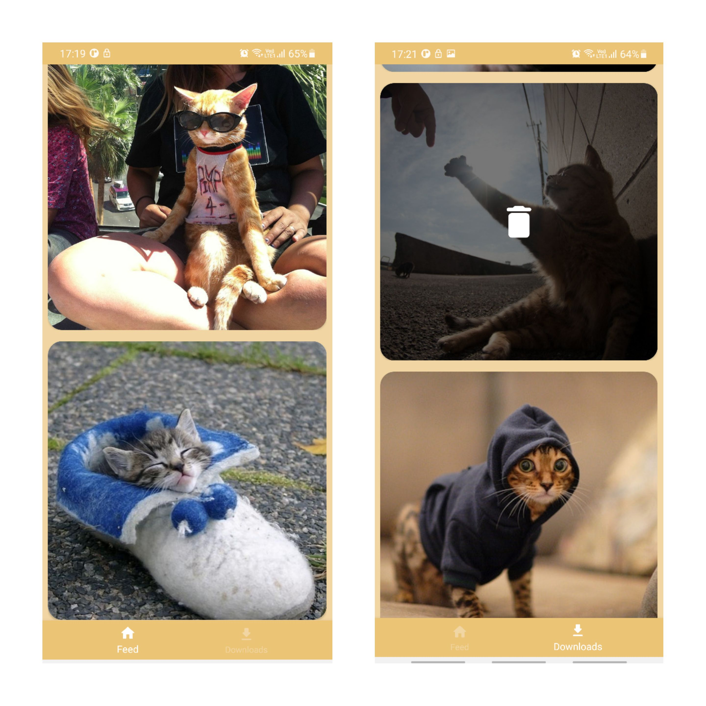
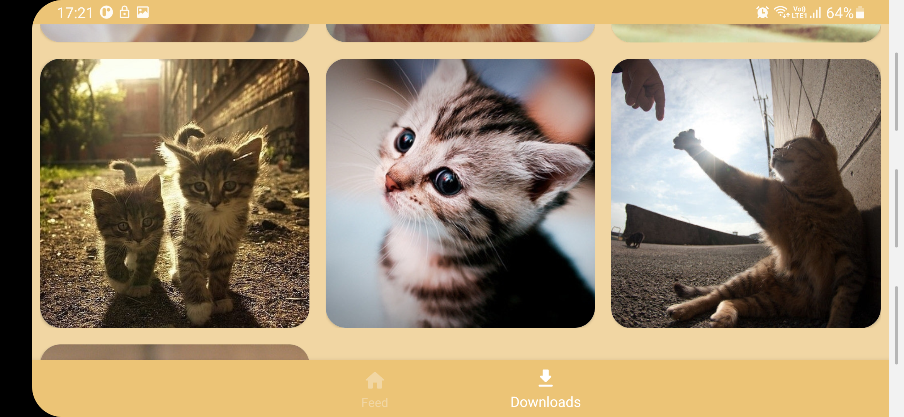

# Description

This is an application that implements [The Cat API](https://thecatapi.com/).
There is ability to save images from feed. They will be placed to **Storage/DCIM/Cats Feed** directory.

## Screenshots

  
   

  
   

